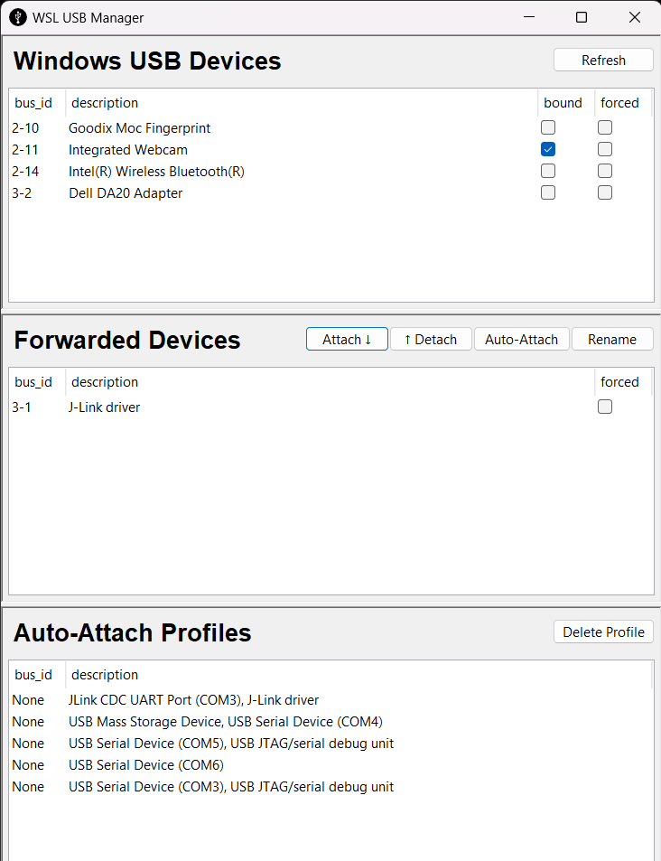
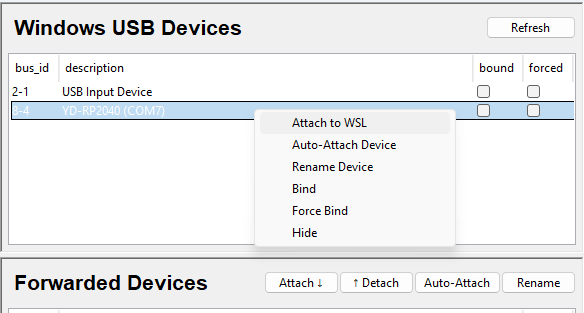
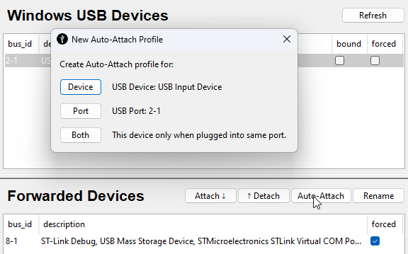
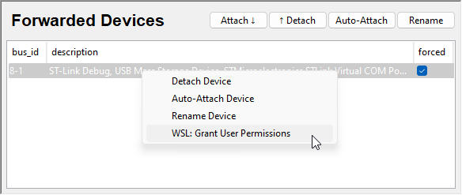
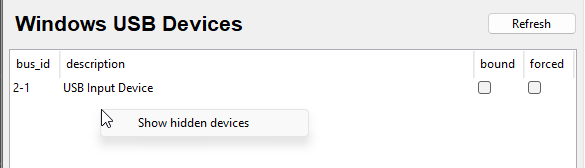
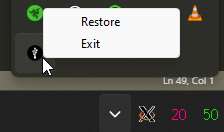

# WSL USB Manager
This application provideds a gui to manage connecting USB devices from Windows to the WSL linux environment.

Behind the scenes it's simply a wrapper for the official command line tools to provide this functionality.
For more information, see:  https://devblogs.microsoft.com/commandline/connecting-usb-devices-to-wsl/

These command line tools are based on an open source project called [USBIP](https://github.com/dorssel/usbipd-win) which is a cross platform solution for sharing USB devices over any network connection.
It uses server software running on the OS where USB devices are directly connected (in this case windows), then a matching client software running on the OS where the USB devices are to be used (wsl/linux).

## Usage
All functionality is contained in the one window with available usb devices seen by windows in the top pane, devices currently connected to WSL in the middle pane, finally auto-connect profiles displayed in the bottom pane.



### Attach / Detach device.
Available devices in the top pane can be connected to WSL by selecting one and pressing the "Attach" button or right-clicking on one and going to "Attach to WSL".



The first time this is done for any particular device, a popup will show requesting Administrator permission; this is required by the `usbpid` service to "bind" a device, granting access to that USB device. Once this permission is given the "bound" column will be checked for that device.

Devices that are attached / forwarded to WSL can only be used in WSL, they're no longer visible to windows. They can be removed from WSL and re-conencted to Windows by hitting the Detach button / right-clicking on them and going to "Detach Device". Once detached they'll be listed in the top pane again (with the bound column still checked) and usable in any Windows app like normal.

For people using multiple distributions of WSL it's important to note that USB devices are connected to the Linux Kernel itself, not any particular distribution. As WSL2 shares the one Kernel instance among all distros, a conencted USB device will be available to all running distros.

### Auto attach (reconnect) devices
If there's a device you want to always connect to WSL an Auto-Attach profile can be created by selecting that button / context menu entry. Options will be given to: always attach that device (when plugged into any usb port), always attach any device plugged into a particular usb port, or always attach a particular device only when plugged into a particular port. This profile will be saved / visible in the bottom pane and the device / port can then be unplugged / re-connected to the computer and always be attached directly to WSL.  


### Renaming devices
Sometimes a connected device will have a rather "unhelpful" name; eg "USB Input Device" could mean lots of different things; or you might have a number of devices with the same name. In this case you can right click on one and go to "Rename" to provide a more convenient label for this device.

### WSL / udev device permissions.
In Linux / WSL many devices are connected by default with ownership only by root, not accessible to the regular user. WSL USB GUI can automate the process of applying user permissions by right-clicking on a Forwarded Device and going to "WSL: Grant User Permissions".  
  
This command currently only interacts with the "default" WSL2 distro and creates / updates `/etc/udev/rules.d/99-wsl-usb-gui.rules` file to set "0666" permissions for the selected device. This should allow the regular user to access the device.  
It also adds a named symlink for the device in `/dev/usb/<my device name>` or `/dev/tty/<my device name>` for convenient access.

### Force bind
Occasionally when trying to attach a device to WSL an error will occur due to be being busy. This often occurs with composite devices that include a flash drive; as the flash drive is mounted by windows it can't be forwarded to WSL. It can also occur with other devices that are used by an application.  
This can be avoided by going to "Force Bind" in the context menu seen above; in this mode the device will be removed from Windows at all time, but can then be attached / detached from WSL reliably.

### Hiding devices
Devices that you never want to forward to WSL (eg. keyboard / mouse) can be hidden from the available pane by going to "Hide" in the context menu. They will no longer be shown / available to attach. If you want to see hidden devices again, right click in the top pane background (not on a device) and an option to show hidden devices will be shown. Once shown, right-clicking on the background again will give the option to hide them again.


### Running in background
When the GUI window is closed, it minimises to the tray so that it can continue to run in the background and handle any newly connected devices as needed.
The gui can be maximised again or exitted completely by right clicking on the logo in the taskbar tray.  



### Non-working devices
Not all USB devices will work out of the box with WSL / linux. For known issues see https://github.com/dorssel/usbipd-win/wiki/Tested-Devices  

Some devices require extra Kernel Drivers, some guidance on compiling your own kernel / modules can be found online eg.
* https://github.com/dorssel/usbipd-win/wiki/WSL-support#building-your-own-usbip-enabled-wsl-2-kernel
* https://github.com/jovton/USB-Storage-on-WSL2/blob/master/README.md
* https://github.com/kevin-doolaeghe/wsl-kernel-modules
* https://kumekay.com/compiling-custom-kernel-for-wsl2/

## Installation

The latest installer is always available on [the releases page](https://gitlab.com/alelec/wsl-usb-gui/-/releases).

The installation of dependencies and configuration of WSL should be handled automatically when you first run the application. 

If any error occur here though, or the program doesn't appear to run correctly, a log of the install process can be viewed by hitting `Win`-`R` on the keyboard and copy/paste in: `notepad %APPDATA%\..\local\wsl-usb-gui\install.log`  
Alternatively, it may help to run through the dependency install steps manually as described below. 

### Manual dependency installation

Check the usbipd-win instructions for any updates: https://github.com/dorssel/usbipd-win/wiki/WSL-support

As of usbipd-win version 2.2.0 (at the time of writing) the following instructions should get you up and running.

USB in WSL requires WSL2 to be used, so if you've already installed `Ubuntu` on your Windows 10/11 installation, check it's version 2. From cmd/powershell:
``` cmd
C:\> wsl --list -v
  NAME                   STATE           VERSION
* Ubuntu                 Running         2
```

Then check the WSL2 kernel is up to date, version 5.10.60.1 or later is needed to support the underlying modules needed for usbip.
From Ubuntu/bash:
```
me@PC:~$ uname -a
Linux PC 5.10.102.1-microsoft-standard-WSL2 #1 SMP Wed Mar 2 00:30:59 UTC 2022 x86_64 x86_64 x86_64 GNU/Linux
```
In my case I'm on 5.10.102.1 which is good to go. 

If you're older than 5.10.60.1 then this can be updated from cmd/powershell:
``` cmd
wsl --shutdown
wsl --update
```

Once your WSL is on the current kernel, there are a couple of usbip tools to install from Ubuntu/bash;
``` bash
sudo apt install linux-tools-5.4.0-77-generic hwdata
sudo update-alternatives --install /usr/local/bin/usbip usbip /usr/lib/linux-tools/*/usbip 20
```

Then download and install the latest usbip server for Windows :
https://github.com/dorssel/usbipd-win/releases

Or it can be installed directly from powershell:
``` powershell
winget install --interactive --exact dorssel.usbipd-win
```

Note: If you are using a third-party firewall, you may have to reconfigure it to allow incoming connections on TCP port 3240.

At this point you should probably reboot your computer, then you can use this tool to manage your USB devices.


## Credits
All the hard work to get USB devices working in WSL is thanks to USBIP and in particular usbipd-win : https://github.com/dorssel/usbipd-win

The WSL USB installer bundles a copy of usbipd-win from https://github.com/dorssel/usbipd-win/releases  
See [Drivers/README](https://github.com/dorssel/usbipd-win/blob/master/Drivers/README.md) and [COPYING](https://github.com/dorssel/usbipd-win/blob/master/COPYING.md) for associated licences.

This gui tool was inspired by https://github.com/K-Francis-H/usbip-gui and originally based on this codebase.
